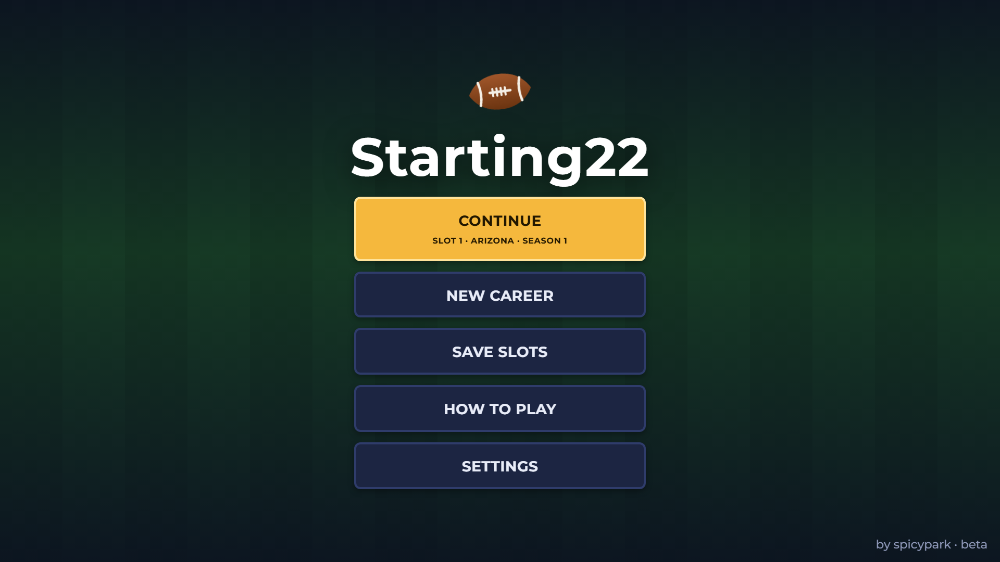
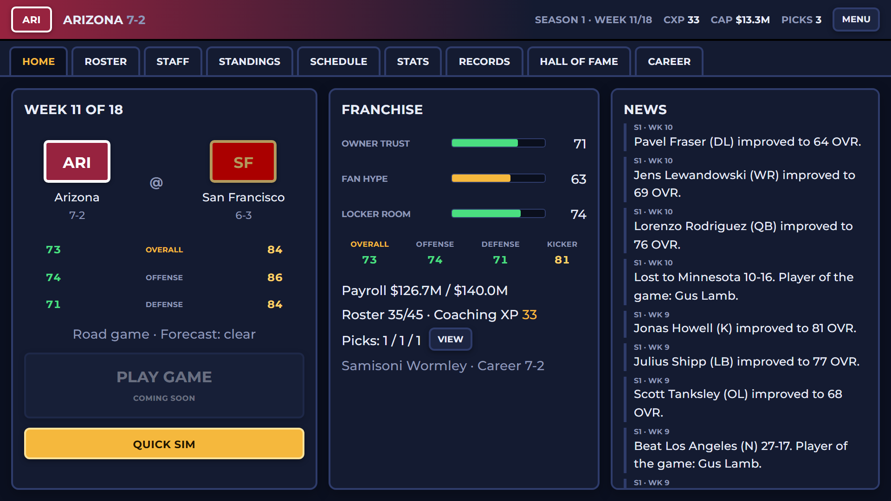

# Starting22

An American football franchise game for the browser. Take over one of 32 teams and run everything: the roster and depth chart, contracts under a salary cap, the draft, free agency, trades, staff, and facilities. Then chase the League Championship.

**[▶ Play Starting22 (beta)](https://spicypark.github.io/Starting22/)**

## Features

- A 32-team league with an 18-week season, bye weeks, and a 14-team playoff
- Roster, depth chart, player development, and training
- Salary cap, contracts, and re-signing
- The draft, free agency, and trades
- League awards, records, a Hall of Fame, and a season-by-season career history
- Careers save in your browser, with export and import
